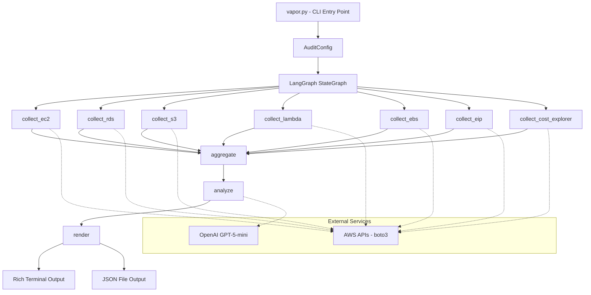
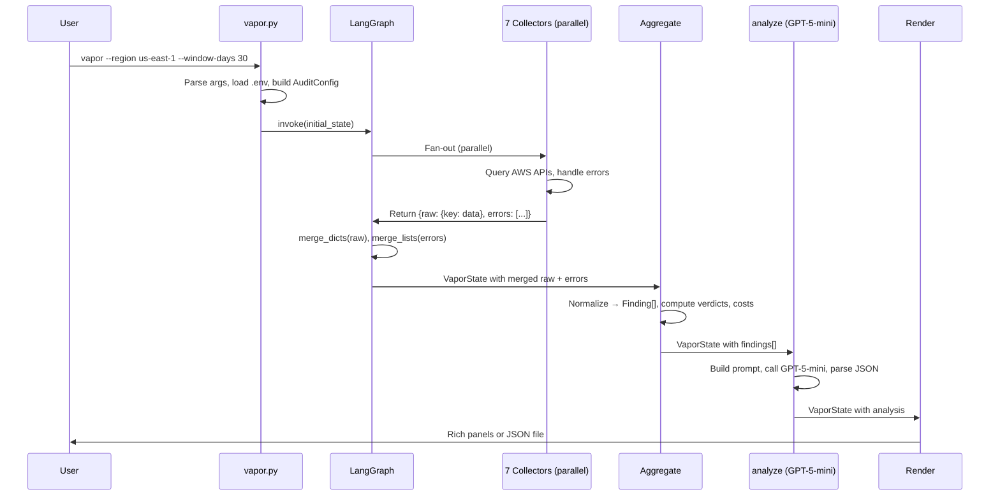

# Design Document: Vapor CLI

## Overview

Vapor is a Python CLI tool that audits an AWS account for cost waste. It uses a LangGraph StateGraph to orchestrate seven parallel data collectors, an aggregation stage that normalizes findings and computes verdicts, an LLM analysis stage (GPT-5-mini) that produces severity-tagged recommendations, and a rendering stage that outputs color-coded Rich panels or JSON files.

The pipeline follows a static parallel fan-out pattern:

```
START → [EC2, RDS, S3, Lambda, EBS, EIP, CostExplorer] → aggregate → analyze → render → END
```

Key design decisions:
- **LangGraph with Annotated reducers** for safe parallel state merging without race conditions
- **Single CloudWatch `get_metric_data` call per collector** to minimize API requests and avoid throttling
- **Pre-computed verdicts in the aggregate node** so the LLM interprets rather than calculates thresholds
- **Graceful error handling at every node** — no single collector failure crashes the pipeline

## Architecture

### System Diagram



### Data Flow Diagram



## Components and Interfaces

### 1. CLI Entry Point (`vapor.py`)

```python
def main() -> None:
    """Parse CLI arguments, load environment, build config, invoke graph pipeline."""
    ...

def parse_args() -> argparse.Namespace:
    """Define and parse all CLI arguments with defaults."""
    ...

def build_config(args: argparse.Namespace) -> AuditConfig:
    """Convert parsed args namespace to AuditConfig dataclass."""
    ...
```

Responsibilities:
- Load `.env` via `python-dotenv` before any AWS/OpenAI client initialization
- Build `AuditConfig` from parsed arguments
- Construct initial `VaporState` with config and empty fields
- Invoke the compiled graph
- Handle top-level exceptions with exit code 1

### 2. Configuration (`config.py`)

```python
@dataclass
class AuditConfig:
    region: str = "us-east-1"
    window_days: int = 30
    ec2_cpu_avg_threshold: float = 10.0
    ec2_cpu_max_threshold: float = 40.0
    rds_cpu_avg_threshold: float = 10.0
    rds_connections_threshold: int = 5
    rds_memory_free_pct_threshold: float = 75.0
    save_raw: str | None = None
    output: str | None = None
```

### 3. State Definitions (`graph/state.py`)

```python
def merge_dicts(a: dict, b: dict) -> dict:
    """Reducer: shallow merge for parallel collector outputs."""
    return {**a, **b}

def merge_lists(a: list, b: list) -> list:
    """Reducer: concatenation for error lists."""
    return a + b

class Finding(TypedDict):
    resource_id: str
    resource_type: str  # EC2 | RDS | S3 | Lambda | EBS | EIP | CostExplorer
    region: str
    issue: str          # machine-readable descriptor
    verdict: str        # underutilized | healthy | overutilized | no_data | gap | ...
    estimated_monthly_cost_usd: float | None
    data: dict
    tags: dict

class AnalysisResult(TypedDict):
    summary: dict       # totalFindings, criticalCount, etc.
    findings: list[dict]

class VaporState(TypedDict):
    config: AuditConfig
    raw: Annotated[dict, merge_dicts]
    errors: Annotated[list, merge_lists]
    findings: list[Finding]
    analysis: AnalysisResult
    report: str
```

### 4. Graph Builder (`graph/graph.py`)

```python
def build_graph() -> CompiledGraph:
    """
    Construct and compile the LangGraph StateGraph with:
    - 7 collector nodes in parallel fan-out from START
    - All collectors converge to 'aggregate'
    - Linear pipeline: aggregate → analyze → render → END
    """
    ...
```

### 5. Collector Nodes

All collectors share a common interface:

```python
def collect_X(state: VaporState) -> dict:
    """
    Query AWS service X, return partial state update.
    
    Returns:
        {"raw": {"X": <collected_data>}, "errors": [<error_strings>]}
    
    Never raises exceptions — all errors are captured in the return value.
    """
    ...
```

#### 5a. EC2 Collector (`graph/nodes/collect_ec2.py`)

```python
def collect_ec2(state: VaporState) -> dict:
    """
    Paginate all EC2 instances, batch CloudWatch CPU metrics (avg, max, p95)
    in a single get_metric_data call with 3600s period.
    
    Critical: Transform instance IDs for CloudWatch query ID format:
        i-0abc123def → cpu_avg_0abc123def (strip 'i-', prepend label)
    """
    ...

def _build_metric_queries(instance_ids: list[str], config: AuditConfig) -> list[dict]:
    """Build MetricDataQueries for all instances. IDs must match ^[a-z][a-zA-Z0-9_]*$."""
    ...

def _safe_metric_id(instance_id: str, stat: str) -> str:
    """Convert instance_id to valid CloudWatch metric query ID."""
    ...
```

#### 5b. RDS Collector (`graph/nodes/collect_rds.py`)

```python
RDS_RAM_GB: dict[str, int]  # Hardcoded RAM lookup for common instance classes

def collect_rds(state: VaporState) -> dict:
    """
    Paginate all RDS instances, batch CloudWatch metrics (CPU avg/max,
    FreeableMemory avg, DatabaseConnections max).
    
    Critical: FreeableMemory is in bytes — divide by 1024^3 for GB.
    """
    ...

def _compute_memory_free_pct(freeable_memory_gb: float, instance_class: str) -> float | None:
    """Compute % free memory using RDS_RAM_GB lookup. Returns None if class unknown."""
    ...
```

#### 5c. S3 Collector (`graph/nodes/collect_s3.py`)

```python
def collect_s3(state: VaporState) -> dict:
    """
    List all buckets, check each for lifecycle configuration.
    
    Critical: NoSuchLifecycleConfiguration is NOT a permissions error —
    catch it separately and set has_lifecycle_policy=False.
    """
    ...
```

#### 5d. Lambda Collector (`graph/nodes/collect_lambda.py`)

```python
def collect_lambda(state: VaporState) -> dict:
    """Paginate all Lambda functions, collect configuration metadata."""
    ...
```

#### 5e. EBS Collector (`graph/nodes/collect_ebs.py`)

```python
def collect_ebs(state: VaporState) -> dict:
    """Paginate unattached EBS volumes (status=available)."""
    ...
```

#### 5f. EIP Collector (`graph/nodes/collect_eip.py`)

```python
def collect_eip(state: VaporState) -> dict:
    """Describe all addresses, filter for unassociated (no AssociationId/InstanceId)."""
    ...
```

#### 5g. Cost Explorer Collector (`graph/nodes/collect_cost_explorer.py`)

```python
def collect_cost_explorer(state: VaporState) -> dict:
    """
    Query Cost Explorer for cost-by-service over window_days.
    
    Critical: Client MUST use region_name='us-east-1' regardless of config.region.
    Critical: Cost Explorer must be enabled — handle gracefully if not.
    """
    ...
```

### 6. Aggregate Node (`graph/nodes/aggregate.py`)

```python
EC2_HOURLY_USD: dict[str, float]  # On-demand pricing lookup
EBS_MONTHLY_PER_GB: dict[str, float]  # gp3: 0.08, gp2: 0.10, io1: 0.125
EIP_MONTHLY_USD: float = 3.65

def aggregate(state: VaporState) -> dict:
    """
    Normalize all raw collector data into Finding[] with pre-computed verdicts
    and estimated costs. Convert datetimes to ISO strings.
    
    Returns:
        {"findings": [Finding, ...]}
    """
    ...

def _compute_ec2_verdict(instance: dict, config: AuditConfig) -> tuple[str, str]:
    """Return (verdict, issue) for an EC2 instance based on CPU thresholds."""
    ...

def _compute_rds_verdict(db: dict, config: AuditConfig) -> list[tuple[str, str]]:
    """Return list of (verdict, issue) tuples — RDS can have multiple issues."""
    ...

def _estimate_ec2_cost(instance_type: str) -> float | None:
    """Lookup hourly rate * 730. Returns None if type unknown."""
    ...

def _estimate_ebs_cost(size_gb: int, volume_type: str) -> float | None:
    """Compute monthly cost based on volume type and size."""
    ...
```

### 7. Analyze Node (`graph/nodes/analyze.py`)

```python
def analyze(state: VaporState) -> dict:
    """
    Send normalized findings to GPT-5-mini with json_object response format.
    Parse response into AnalysisResult. On failure, produce fallback result.
    
    Returns:
        {"analysis": AnalysisResult}
    """
    ...

def _build_fallback_analysis(error_msg: str) -> AnalysisResult:
    """Construct a minimal AnalysisResult describing the LLM failure."""
    ...
```

### 8. Render Node (`graph/nodes/render.py`)

```python
def render(state: VaporState) -> dict:
    """
    Output the analysis as Rich terminal panels (default) or JSON file (--output).
    If --save-raw is set, write raw collector JSON first.
    
    Returns:
        {"report": "<rendered_summary>"}
    """
    ...

def _render_terminal(analysis: AnalysisResult, config: AuditConfig) -> str:
    """Render color-coded Rich panels to terminal. Returns summary string."""
    ...

def _render_json_file(analysis: AnalysisResult, path: str) -> None:
    """Write AnalysisResult as pretty-printed JSON with default=str."""
    ...

def _save_raw_json(raw: dict, path: str) -> None:
    """Write raw collector state as pretty-printed JSON with default=str."""
    ...

SEVERITY_COLORS: dict[str, str] = {
    "critical": "bold red",
    "high": "bold yellow",
    "medium": "bold blue",
    "low": "bold green",
}
```

### 9. Prompts (`prompts/`)

```python
# prompts/system.py
SYSTEM_PROMPT: str  # Expert AWS cost optimization engineer instructions

# prompts/user.py
def build_user_message(findings: list[Finding], config: AuditConfig) -> str:
    """Format findings + context (region, window, thresholds) for the LLM."""
    ...
```

## Data Models

### Finding TypedDict

| Field | Type | Description |
|-------|------|-------------|
| `resource_id` | `str` | AWS resource identifier (e.g., `i-0abc123def`) |
| `resource_type` | `str` | Service category: EC2, RDS, S3, Lambda, EBS, EIP, CostExplorer |
| `region` | `str` | AWS region where resource resides |
| `issue` | `str` | Machine-readable issue descriptor (e.g., `underutilized_instance`) |
| `verdict` | `str` | One of: underutilized, healthy, overutilized, no_data, gap, unattached, unassociated, no_lifecycle_policy, high_memory, high_timeout, overprovisioned_memory |
| `estimated_monthly_cost_usd` | `float \| None` | Estimated monthly cost, None if unknown |
| `data` | `dict` | All raw metrics and facts about the resource |
| `tags` | `dict` | AWS resource tags as key-value pairs |

### AnalysisResult TypedDict

| Field | Type | Description |
|-------|------|-------------|
| `summary` | `dict` | Aggregate counts: totalFindings, criticalCount, highCount, mediumCount, lowCount, estimatedMonthlySavings |
| `findings` | `list[dict]` | LLM-produced findings with title, severity, category, resource_id, detail, estimated_savings, fix |

### AuditConfig Dataclass

| Field | Type | Default | Description |
|-------|------|---------|-------------|
| `region` | `str` | `us-east-1` | Target AWS region |
| `window_days` | `int` | `30` | CloudWatch lookback window |
| `ec2_cpu_avg_threshold` | `float` | `10.0` | EC2 CPU avg % underutilization |
| `ec2_cpu_max_threshold` | `float` | `40.0` | EC2 CPU max % underutilization |
| `rds_cpu_avg_threshold` | `float` | `10.0` | RDS CPU avg % underutilization |
| `rds_connections_threshold` | `int` | `5` | RDS idle connections threshold |
| `rds_memory_free_pct_threshold` | `float` | `75.0` | RDS memory over-provisioned % |
| `save_raw` | `str \| None` | `None` | Path to write raw collector JSON |
| `output` | `str \| None` | `None` | Path to write analysis JSON |

### VaporState TypedDict

| Field | Type | Reducer | Description |
|-------|------|---------|-------------|
| `config` | `AuditConfig` | — | Immutable config passed to all nodes |
| `raw` | `dict` | `merge_dicts` | Collector outputs keyed by service name |
| `errors` | `list` | `merge_lists` | Non-fatal error messages from collectors |
| `findings` | `list[Finding]` | — | Normalized findings from aggregate |
| `analysis` | `AnalysisResult` | — | LLM analysis output |
| `report` | `str` | — | Rendered report summary string |

### Verdict Decision Matrix

| Resource Type | Condition | Verdict | Issue Key |
|--------------|-----------|---------|-----------|
| EC2 | `cpu.no_data == true` | `no_data` | `instance_no_metrics` |
| EC2 | `cpu.avg < threshold AND cpu.max < threshold` | `underutilized` | `underutilized_instance` |
| EC2 | Otherwise | `healthy` | `healthy_instance` |
| RDS | `cpu.avg < threshold AND connections_max < threshold` | `underutilized` | `underutilized_database` |
| RDS | `memory_free_pct > threshold` | `overprovisioned_memory` | `overprovisioned_memory` |
| RDS | Otherwise | `healthy` | `healthy_database` |
| S3 | `has_lifecycle_policy == false` | `no_lifecycle_policy` | `missing_lifecycle_policy` |
| S3 | Otherwise | `healthy` | `healthy_bucket` |
| Lambda | `memory_size >= 1024` | `high_memory` | `high_memory_function` |
| Lambda | `timeout >= 900` | `high_timeout` | `high_timeout_function` |
| Lambda | Otherwise | `healthy` | `healthy_function` |
| EBS | Always (unattached filter) | `unattached` | `unattached_volume` |
| EIP | Always (unassociated filter) | `unassociated` | `unassociated_eip` |
| Any | Collector error | `gap` | `collector_error` |

### Cost Estimation Lookup Tables

**EC2 On-Demand (USD/hour):**

| Type | Rate |
|------|------|
| t3.micro | 0.0104 |
| t3.small | 0.0208 |
| t3.medium | 0.0416 |
| t3.large | 0.0832 |
| t3.xlarge | 0.1664 |
| t3.2xlarge | 0.3328 |
| m5.large | 0.096 |
| m5.xlarge | 0.192 |
| m5.2xlarge | 0.384 |
| m5.4xlarge | 0.768 |
| m5.8xlarge | 1.536 |
| c5.large | 0.085 |
| c5.xlarge | 0.17 |
| c5.2xlarge | 0.34 |
| r5.large | 0.126 |
| r5.xlarge | 0.252 |
| r5.2xlarge | 0.504 |

Monthly = hourly × 730

**EBS (USD/GB/month):** gp3: $0.08, gp2: $0.10, io1: $0.125

**EIP (unassociated):** $3.65/month ($0.005/hour × 730)

## Correctness Properties

*A property is a characteristic or behavior that should hold true across all valid executions of a system — essentially, a formal statement about what the system should do. Properties serve as the bridge between human-readable specifications and machine-verifiable correctness guarantees.*

### Property 1: CLI argument round-trip

*For any* valid CLI argument (region string, positive integer window_days, positive float thresholds, or file path strings), parsing the argument list and constructing an AuditConfig SHALL produce a config object where the corresponding field matches the input value exactly.

**Validates: Requirements 1.1, 1.3, 1.7, 1.9, 1.11, 1.13, 1.15**

### Property 2: merge_dicts preserves all keys

*For any* two dictionaries with non-overlapping keys, `merge_dicts(a, b)` SHALL produce a dictionary containing all key-value pairs from both inputs, with length equal to `len(a) + len(b)`.

**Validates: Requirements 2.4**

### Property 3: merge_lists produces correct concatenation

*For any* two lists, `merge_lists(a, b)` SHALL produce a list whose length equals `len(a) + len(b)` and whose elements are `a` followed by `b` in order.

**Validates: Requirements 2.5**

### Property 4: CloudWatch metric ID validity

*For any* valid EC2 instance ID (matching pattern `i-[0-9a-f]+`) and any stat label (avg, max, p95), the `_safe_metric_id` function SHALL produce a string that matches the regex `^[a-z][a-zA-Z0-9_]*$`.

**Validates: Requirements 3.4**

### Property 5: Tag extraction correctness

*For any* list of tag dictionaries (each with "Key" and "Value" string fields), the tag extraction function SHALL produce a dictionary where each Key maps to its corresponding Value, and an empty input list produces an empty dictionary.

**Validates: Requirements 3.6**

### Property 6: EIP unassociated filtering

*For any* list of Elastic IP address descriptions, the filtering logic SHALL return only addresses where AssociationId is absent or InstanceId is absent, and SHALL never return addresses that have both AssociationId and InstanceId present.

**Validates: Requirements 8.2**

### Property 7: RDS memory percentage computation

*For any* positive freeable memory value in bytes and any known RDS instance class from the RAM lookup table, the computed `memory_free_pct` SHALL equal `(bytes / 1024^3 / total_ram_gb) * 100`, and for any instance class NOT in the lookup table, `memory_free_pct` SHALL be None.

**Validates: Requirements 4.4, 4.5, 4.6**

### Property 8: EC2 verdict correctness

*For any* EC2 instance data and AuditConfig thresholds:
- If `cpu.no_data` is true, verdict SHALL be "no_data"
- If `cpu.avg < ec2_cpu_avg_threshold` AND `cpu.max < ec2_cpu_max_threshold` (and no_data is false), verdict SHALL be "underutilized"
- Otherwise, verdict SHALL be "healthy"

**Validates: Requirements 10.2, 10.3**

### Property 9: RDS verdict correctness

*For any* RDS instance data and AuditConfig thresholds:
- If `cpu.avg < rds_cpu_avg_threshold` AND `connections_max < rds_connections_threshold`, verdict SHALL be "underutilized"
- If `memory_free_pct > rds_memory_free_pct_threshold`, verdict SHALL be "overprovisioned_memory"
- Otherwise, verdict SHALL be "healthy"

**Validates: Requirements 10.4, 10.5**

### Property 10: Lambda verdict correctness

*For any* Lambda function data:
- If `memory_size >= 1024`, verdict SHALL be "high_memory"
- If `timeout >= 900`, verdict SHALL be "high_timeout"
- Otherwise, verdict SHALL be "healthy"

**Validates: Requirements 10.7, 10.8**

### Property 11: Simple resource verdict invariants

*For any* S3 bucket with `has_lifecycle_policy == false`, verdict SHALL be "no_lifecycle_policy". *For any* EBS volume in the raw data, verdict SHALL always be "unattached". *For any* EIP in the raw data, verdict SHALL always be "unassociated".

**Validates: Requirements 10.6, 10.9, 10.10**

### Property 12: Cost estimation correctness

*For any* EC2 instance with a known instance_type, `estimated_monthly_cost_usd` SHALL equal `EC2_HOURLY_USD[instance_type] * 730`. *For any* EBS volume with known volume_type and size_gb, cost SHALL equal `EBS_MONTHLY_PER_GB[volume_type] * size_gb`. *For any* unassociated EIP, cost SHALL equal 3.65.

**Validates: Requirements 10.11, 10.12, 10.13**

### Property 13: Datetime serialization in findings

*For any* raw collector output containing datetime objects, after aggregation all values in Finding.data dictionaries that were datetime objects SHALL be ISO 8601 formatted strings (matching the pattern produced by `datetime.isoformat()`).

**Validates: Requirements 10.14**

### Property 14: EC2 memory visibility note invariant

*For any* EC2 finding produced by the aggregate node, the `data` dictionary SHALL contain a "memory" key with `available: false` and a reason string indicating CloudWatch agent is required.

**Validates: Requirements 10.15**

### Property 15: Collector errors produce gap findings

*For any* non-empty list of error strings in VaporState.errors, the aggregate node SHALL produce at least one Finding with verdict "gap" for each error, and the total number of gap findings SHALL be greater than or equal to the number of errors.

**Validates: Requirements 10.16, 14.1, 14.2**

### Property 16: Cost Explorer total equals sum of parts

*For any* list of per-service cost values returned by Cost Explorer, `total_cost_usd` SHALL equal the sum of all individual service costs.

**Validates: Requirements 9.3**

### Property 17: User message includes all context

*For any* AuditConfig and non-empty findings list, the user message built by `build_user_message` SHALL contain the region string, window_days value, total finding count, and all threshold values from the config.

**Validates: Requirements 11.2**

### Property 18: Analysis result schema completeness

*For any* valid JSON string conforming to the expected LLM output schema, parsing SHALL produce an AnalysisResult where the summary contains totalFindings, criticalCount, highCount, mediumCount, lowCount, and estimatedMonthlySavings fields, and each finding in the findings list contains title, severity, category, resource_id, detail, estimated_savings, and fix fields.

**Validates: Requirements 11.3, 11.4, 11.5**

### Property 19: Findings sorted by severity

*For any* list of findings with mixed severities, the render node SHALL output them in descending severity order: all critical findings before high, all high before medium, all medium before low.

**Validates: Requirements 12.6**

### Property 20: Aggregate produces complete Finding structures

*For any* valid raw collector output (EC2, RDS, S3, Lambda, EBS, EIP, or Cost Explorer data), the aggregate node SHALL produce Finding TypedDicts where every required field (resource_id, resource_type, region, issue, verdict, estimated_monthly_cost_usd, data, tags) is present and correctly typed.

**Validates: Requirements 10.1**

## Error Handling

### Strategy: Fail-Safe at Every Node

The pipeline is designed so that no single component failure terminates the process. Every node boundary is an error containment zone.

### Collector Error Handling

All seven collectors follow the same pattern:

```python
def collect_X(state: VaporState) -> dict:
    try:
        # ... AWS API calls ...
        return {"raw": {"X": result}, "errors": []}
    except Exception as e:
        return {
            "raw": {"X": {"error": str(e), "data": []}},
            "errors": [f"collect_X failed: {str(e)}"]
        }
```

Specific exceptions handled within collectors before the catch-all:
- **S3**: `ClientError` with code `NoSuchLifecycleConfiguration` → not an error, sets `has_lifecycle_policy: false`
- **S3**: Other `ClientError` → recorded per-bucket, collector continues
- **Cost Explorer**: Permission/enablement errors → returns `{"available": false, "error": "..."}`
- **EC2/RDS**: Missing CloudWatch data → sets `no_data: true` per resource, not a collector error

### Aggregate Error Handling

- Iterates raw data defensively with `.get()` access patterns
- Converts datetime objects safely (missing datetimes become `None`)
- Creates "gap" findings for each collector error — errors become visible findings rather than silent failures

### Analyze Error Handling

```python
def analyze(state: VaporState) -> dict:
    try:
        response = client.chat.completions.create(...)
        result = json.loads(response.choices[0].message.content)
        return {"analysis": result}
    except (openai.APIError, json.JSONDecodeError, KeyError) as e:
        return {"analysis": _build_fallback_analysis(str(e))}
```

Fallback analysis contains a single finding describing the LLM failure, allowing the pipeline to complete and the user to see collector data was gathered even if analysis failed.

### Render Error Handling

- `json.dumps(..., default=str)` prevents serialization crashes on unexpected types
- File write errors are caught and reported to terminal without crashing
- Terminal rendering uses try/except around Rich calls — falls back to plain text if Rich fails

### CLI-Level Error Handling

```python
def main():
    try:
        # ... parse, build, invoke ...
        sys.exit(0)
    except Exception as e:
        console.print(f"[bold red]Fatal error:[/] {e}")
        sys.exit(1)
```

## Testing Strategy

### Approach

Testing uses a dual strategy:
1. **Property-based tests** (via `hypothesis`) for universal properties of pure logic
2. **Unit tests** (via `pytest`) for specific examples, edge cases, and mocked integrations

### Property-Based Testing Configuration

- **Library**: `hypothesis` (Python's standard PBT library)
- **Minimum iterations**: 100 per property (`@settings(max_examples=100)`)
- **Tag format**: Comment above each test: `# Feature: vapor-cli, Property N: <property text>`

### Test Organization

```
tests/
  test_config.py          # Property 1: CLI arg round-trip
  test_state.py           # Properties 2, 3: merge_dicts, merge_lists
  test_metric_id.py       # Property 4: CloudWatch metric ID validity
  test_tags.py            # Property 5: Tag extraction
  test_eip_filter.py      # Property 6: EIP filtering
  test_rds_memory.py      # Property 7: RDS memory computation
  test_verdicts.py        # Properties 8, 9, 10, 11: All verdict logic
  test_cost_estimation.py # Property 12: Cost estimation
  test_datetime.py        # Property 13: Datetime serialization
  test_aggregate.py       # Properties 14, 15, 16, 20: Aggregate invariants
  test_prompts.py         # Property 17: User message construction
  test_analysis.py        # Property 18: Analysis result parsing
  test_render.py          # Property 19: Severity sorting
  test_collectors.py      # Edge cases: error handling, integration mocks
  test_pipeline.py        # Integration: end-to-end with mocked AWS/OpenAI
```

### Unit Test Coverage

Unit tests handle:
- Default value verification (all the "SHALL default to X" criteria)
- Error handling edge cases (permissions errors, API failures, malformed responses)
- Integration behavior (correct boto3 client configuration, API call parameters)
- File I/O (JSON output written correctly, raw data saved)
- Rich rendering (panels contain expected content)

### Integration Test Strategy

- Mock `boto3` clients using `unittest.mock.patch` or `moto` library
- Mock OpenAI client to return predictable JSON responses
- Test full pipeline end-to-end with all mocked services to verify graph execution order

### Key Test Dependencies

```
pytest>=7.0.0
hypothesis>=6.0.0
moto>=5.0.0        # AWS service mocking (optional, can use unittest.mock)
pytest-cov>=4.0.0  # Coverage reporting
```

